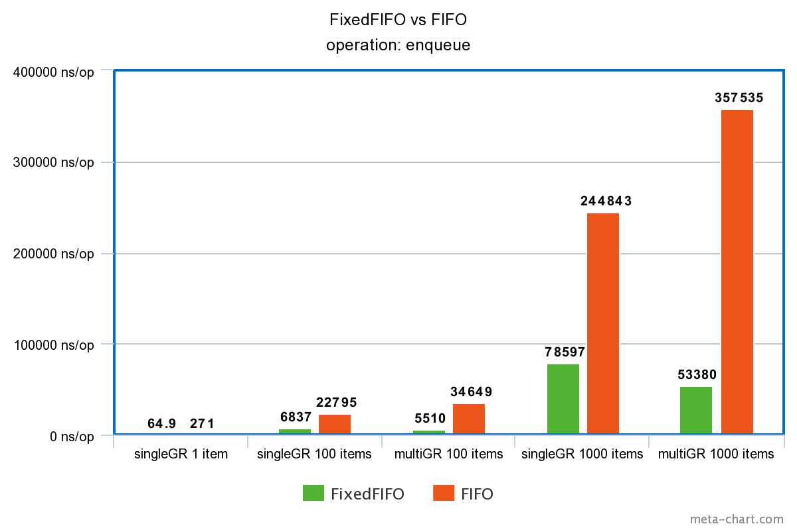
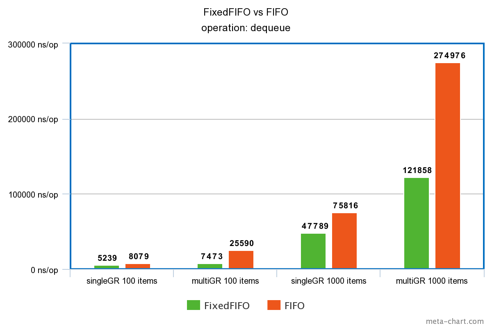

[](https://pkg.go.dev/mod/github.com/enriquebris/goconcurrentqueue) [](https://godoc.org/github.com/enriquebris/goconcurrentqueue)   [](https://goreportcard.com/report/github.com/enriquebris/goconcurrentqueue)  [](https://travis-ci.org/enriquebris/goconcurrentqueue) [](https://codecov.io/gh/enriquebris/goconcurrentqueue) [](https://www.codefactor.io/repository/github/enriquebris/goconcurrentqueue) [](https://github.com/avelino/awesome-go)

# goconcurrentqueue - Concurrent safe queues
The package goconcurrentqueue offers a public interface Queue with methods for a [queue](https://en.wikipedia.org/wiki/Queue_(abstract_data_type)).
It comes with multiple Queue's concurrent-safe implementations, meaning they could be used concurrently by multiple goroutines without adding race conditions.

## Topics
 - [Installation](#installation)
 - [Documentation](#documentation)
 - [Queues](#queues)
    - [FIFO](#fifo)
    - [FixedFIFO](#fixedfifo)
    - [Benchmarks](#benchmarks-fixedfifo-vs-fifo)
 - [Get started](#get-started)
 - [History](#history)

## Installation

Execute
```bash
go get github.com/enriquebris/goconcurrentqueue
```

This package is compatible with the following golang versions:
 - 1.7.x
 - 1.8.x
 - 1.9.x
 - 1.10.x
 - 1.11.x
 - 1.12.x
 - 1.13.x
 - 1.14.x

## Documentation
Visit [goconcurrentqueue at godoc.org](https://godoc.org/github.com/enriquebris/goconcurrentqueue)

## Queues

- First In First Out (FIFO)
    - [FIFO](#fifo)
    - [FixedFIFO](#fixedfifo)
    - [Benchmarks FixedFIFO vs FIFO](#benchmarks-fixedfifo-vs-fifo)

### FIFO

**FIFO**: concurrent-safe auto expandable queue.

#### pros
 - It is possible to enqueue as many items as needed.
 - Extra methods to get and remove enqueued items:
     - [Get](https://godoc.org/github.com/enriquebris/goconcurrentqueue#FIFO.Get): returns an element's value and keeps the element at the queue
     - [Remove](https://godoc.org/github.com/enriquebris/goconcurrentqueue#FIFO.Get): removes an element (using a given position) from the queue

#### cons
 - It is slightly slower than FixedFIFO.

### FixedFIFO

**FixedFIFO**: concurrent-safe fixed capacity queue.

#### pros
 - FixedFIFO is, at least, 2x faster than [FIFO](#fifo) in concurrent scenarios (multiple GR accessing the queue simultaneously).

#### cons
 - It has a fixed capacity meaning that no more items than this capacity could coexist at the same time. 

## Benchmarks FixedFIFO vs FIFO

The numbers for the following charts were obtained by running the benchmarks in a 2012 MacBook Pro (2.3 GHz Intel Core i7 - 16 GB 1600 MHz DDR3) with golang v1.12 

### Enqueue



### Dequeue



## Get started

### FIFO queue simple usage
[Live code - playground](https://play.golang.org/p/CRhg7kX0ikH)

```go
package main

import (
	"fmt"

	"github.com/enriquebris/goconcurrentqueue"
)

type AnyStruct struct {
	Field1 string
	Field2 int
}

func main() {
	queue := goconcurrentqueue.NewFIFO()

	queue.Enqueue("any string value")
	queue.Enqueue(5)
	queue.Enqueue(AnyStruct{Field1: "hello world", Field2: 15})

	// will output: 3
	fmt.Printf("queue's length: %v\n", queue.GetLen())

	item, err := queue.Dequeue()
	if err != nil {
		fmt.Println(err)
		return
	}

	// will output "any string value"
	fmt.Printf("dequeued item: %v\n", item)

	// will output: 2
	fmt.Printf("queue's length: %v\n", queue.GetLen())

}
```

### Wait until an element gets enqueued
[Live code - playground](https://play.golang.org/p/S7oSg3iUNhs)

```go
package main

import (
	"fmt"
	"time"

	"github.com/enriquebris/goconcurrentqueue"
)

func main() {
	var (
		fifo = goconcurrentqueue.NewFIFO()
		done = make(chan struct{})
	)

	go func() {
		fmt.Println("1 - Waiting for next enqueued element")
		value, _ := fifo.DequeueOrWaitForNextElement()
		fmt.Printf("2 - Dequeued element: %v\n", value)

		done <- struct{}{}
	}()

	fmt.Println("3 - Go to sleep for 3 seconds")
	time.Sleep(3 * time.Second)

	fmt.Println("4 - Enqueue element")
	fifo.Enqueue(100)

	<-done
}

```

### Dependency Inversion Principle using concurrent-safe queues

*High level modules should not depend on low level modules. Both should depend on abstractions.* Robert C. Martin

[Live code - playground](https://play.golang.org/p/3GAbyR7wrX7)

```go
package main

import (
	"fmt"

	"github.com/enriquebris/goconcurrentqueue"
)

func main() {
	var (
		queue          goconcurrentqueue.Queue
		dummyCondition = true
	)

	// decides which Queue's implementation is the best option for this scenario
	if dummyCondition {
		queue = goconcurrentqueue.NewFIFO()
	} else {
		queue = goconcurrentqueue.NewFixedFIFO(10)
	}

	fmt.Printf("queue's length: %v\n", queue.GetLen())
	workWithQueue(queue)
	fmt.Printf("queue's length: %v\n", queue.GetLen())
}

// workWithQueue uses a goconcurrentqueue.Queue to perform the work
func workWithQueue(queue goconcurrentqueue.Queue) error {
	// do some work

	// enqueue an item
	if err := queue.Enqueue("test value"); err != nil {
		return err
	}

	return nil
}
```

## History

### v0.5.1

- FIFO.DequeueOrWaitForNextElement() was modified to avoid deadlock when DequeueOrWaitForNextElement && Enqueue are invoked around the same time.
- Added multiple goroutine unit testings for FIFO.DequeueOrWaitForNextElement() 

### v0.5.0

- Added DequeueOrWaitForNextElement()

### v0.4.0

- Added QueueError (custom error)

### v0.3.0

- Added FixedFIFO queue's implementation (at least 2x faster than FIFO for multiple GRs)
- Added benchmarks for both FIFO / FixedFIFO
- Added GetCap() to Queue interface
- Removed Get() and Remove() methods from Queue interface

### v0.2.0

- Added Lock/Unlock/IsLocked methods to control operations locking

### v0.1.0

- First In First Out (FIFO) queue added
